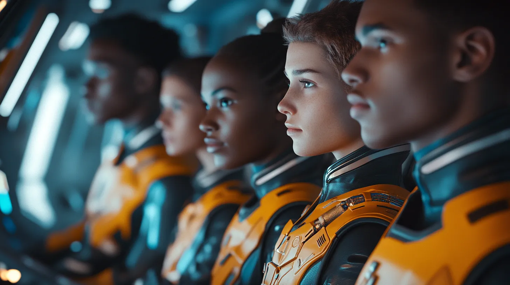

import { Card, CardGrid } from '@astrojs/starlight/components';
import ListCard from '../../components/ListCard.astro'
import { ShowcaseProfile } from 'starlight-showcases'
import { Image } from 'astro:assets';
import chooseAdventure from '../../assets/ChooseAdventure.webp';
import { Tabs, TabItem } from '@astrojs/starlight/components';
import { Steps } from '@astrojs/starlight/components';
import { LinkButton } from '@astrojs/starlight/components';

---

<h2 class="">Choose (your own)  adventure</h2>
<Image src={chooseAdventure} alt="Choose your own adventure" />

---

 
  

  
 
    
 
      <h2 data-page-title="" class="astro-jbfsktt5" data-astro-source-file="/Users/peteargent/apps/000_future/foundation/node_modules/@astrojs/starlight/components/Hero.astro" data-astro-source-loc="47:5">You already have what we're looking for</h2> 
      

        You have a unique combination of strengths, skills, interests and experiences — and that is very valuable to Future's Edge and the world!
      
 
    
 
  

{/* ---

## You already have what we^re looking for

You have a unique combination of strengths, skills, interests and experiences — and that is very valuable to Future's Edge and the world!

 */}

---

## Experience life on the Edge

<CardGrid stagger>
  <Card title="Become a recruit" icon="pencil">
    1. **Apply to be a Special Agent** in the world’s most ambitious intelligence agency
    2. **Membership is free** and open to all
    3. **Take your life to the next level** and make a difference
  </Card>
  
  <Card title="Report to field office" icon="laptop">
    1. Attend your first field office briefing
    2. Meetings are virtual by default
    2. Meet your international colleagues
    3. Begin your training missions
    4. Attend weekly online briefings
  </Card>
  <Card title="Become a recruit" icon="open-book">
    - 1. **Apply to be a Special Agent** in the world’s most ambitious intelligence agency
    - 2. **Membership is free** and open to all
    - 3. **Take your life to the next level** and make a difference
  </Card>
  
  <Card title="Report to field office" icon="open-book">
    - 1. **Apply to be a Special Agent** in the world’s most ambitious intelligence agency
    - 2. **Membership is free** and open to all
    - 3. **Take your life to the next level** and make a difference
  </Card>
  
  
</CardGrid>

<Steps>

1. Become a recruit

    1. Apply to be a Special Agent in the world's most ambitious intelligence agency

2. Report to field office

    1. Attend your first field office briefing
    2. Meetings are virtual by default
    2. Meet your international colleagues
    3. Begin your training missions
    4. Attend weekly online briefings

3. Complete missions

    1. Choose between solo and collaborative missions
    1. Meet new recruits from around the world
    1. Create measurable social impact
    1. Level up your skills
    1. Earn your stripes and build your reputation

4. Connect & grow

    1. Develop your strengths and explore your interests
    2. Design your achievement roadmap
    3. Discover your leadership instincts

5. Level up

    1. See your value contribution grow 
    1. Complete training missions and demonstrate your new skills
    1. Pass the basic training requrements
    1. Attend your promotion ceremony to receive your new rank and perks
</Steps>

  <h1>Timeline</h1>

  <ul class="timeline">
    <li class="event" data-date="65Million B.C.">
      <h3>Dinosaurs Roamed the Earth</h3>
      
RAWWWWWWRRR 🐢🦂

    </li>
    <li class="event" data-date="2005">
      <h3>Creative Component Launched</h3>
      
"We can be all things to all people!" 📣
    
    </li>
    <li class="event" id="date" data-date="2009">
      <h3>Squareflair was Born</h3>
      

 
"We can be all things to Squarespace users!" 📣
    
    </li>
    
    <li class="event" data-date="2021">
      
      <h3>Squareflair Today</h3>
      
      "We design and build from scratch!" 📣 When we say <em><strong>100% custom</strong></em> we mean it— and we build all sites on the Squarespace Developer platform.

      Did you know that all of our pixels are hand-forged from the rarest of subpixels grown and harvested in the <em>Nerd Forest</em>?  🤜💥🤛
      
      Our success can be measured by lives and brands enhanced by 9+ years of 100% Squarespace-focused service!
      
      <a href="https://www.squareflair.com">squareflair.com</a>
    </li>
  </ul>

---

<LinkButton href="/foundation/foundation-introduction/">Get started</LinkButton>

