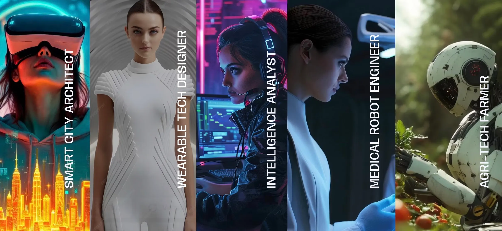

import { Card, CardGrid } from '@astrojs/starlight/components';
import { ShowcaseProfile } from 'starlight-showcases'

---

  
<h2 class="">Choose (your own) adventure</h2>

### You already have what we're looking for

You have a unique combination of strengths, skills, interests and experiences — and that is very valuable to Future's Edge and the world!

---

### Experience life on the Edge

<ShowcaseProfile
  entries={[
    {
      name: 'Vision',
      picture: import('../../assets/icons/picture.svg'),
      href: './vision/',
      description:
        "The 5 year vision and beyond for Future's Edge.",
    },
    {
      name: 'Mission',
      picture:import('../../assets/icons/crosshair.1.svg'),
      href: './mission/',
      description:
        "The 5 year mission to build a fairer future.",
    },
    {
      name: 'Values',
      picture: import('../../assets/icons/compass.svg'),
      href: './values/',
      description:
        "The core values at Future's Edge.",
    },
  ]}
/>

